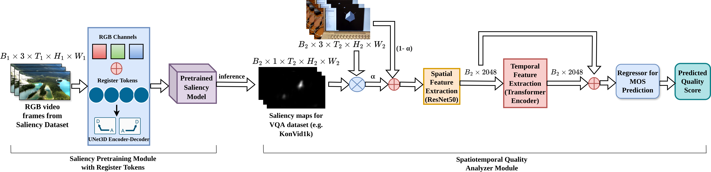

# DAGR-VQA: Dynamic Attention with Global Registers for Video Quality Assessment

This repository contains the implementation of **DAGR-VQA** (Dynamic Attention with Global Registers for Video Quality Assessment), a novel no-reference video quality assessment framework that integrates register-tokens directly into a convolutional backbone for spatio-temporal, dynamic saliency prediction.



## Overview

DAGR-VQA is the first framework to integrate register-tokens as global context carriers within a convolutional UNet3D backbone, enabling dynamic, HVS-inspired attention that produces temporally adaptive saliency maps. Unlike previous methods that use saliency as auxiliary input, DAGR-VQA embeds context fundamentally within feature extraction of the video sequence.

### Key Features

- **Register-Token Integration**: Learnable register tokens embedded as global priors during convolutional feature extraction
- **Dynamic Saliency Prediction**: Temporally adaptive saliency maps that track salient regions over time without explicit motion estimation
- **HVS-Inspired Attention**: Mimics human visual system by directing attention to perceptually important regions
- **Real-Time Performance**: Achieves 387.7 FPS at 1080p resolution
- **State-of-the-Art Results**: Competitive performance across LSVQ, KonVid-1k, LIVE-VQC, and YouTube-UGC datasets

## Files in this Repository

The following scripts are included in this repository:

1. **`extract_frame.py`**: Extract 8 frames per video from LSVQ dataset
2. **`train_sal.py`**: Train saliency model (DIEM + register tokens) on DHF1K dataset
3. **`inference_sal.py`**: Generate saliency maps for LSVQ videos using pretrained model
4. **`train_lsvq.py`**: Train VQA model on LSVQ with train/val/test split
5. **`evaluate_vqa.py`**: Evaluate and fine-tune VQA model (SimpleFusion)

## Installation

To use DAGR-VQA, clone this repository, activate an virtual environment and install the required dependencies:

```bash
git clone https://github.com/yourusername/DAGR-VQA.git
cd DAGR-VQA
python3 -m venv dagrvqa
source dagrvqa/bin/activate
pip install -r requirements.txt
```

## Pipeline (Step-by-Step)

### 1. Train Saliency Model
```bash
python train_sal.py
```

### 2. Generate Saliency Maps
Edit `inference_sal.py` to set your checkpoint, then run:
```bash
python inference_sal.py
```

### 3. Train VQA Model
```bash
python train_lsvq.py
```

### 4. Evaluate VQA
```bash
python evaluate_vqa.py
```

## Results

### Model Performance on Benchmark Datasets

| Dataset | PLCC | SRCC |
|---------|------|------|
| **LSVQ** | 0.892 | **0.907** |
| **KonVid-1k** | 0.863 | 0.896 |
| **LIVE-VQC** | **0.915** | 0.886 |
| **YouTube-UGC** | **0.913** | 0.910 |
| **Average** | **0.896** | **0.900** |

### System Performance

| Metric | DAGR-VQA |
|--------|----------|
| **Inference Speed** | 387.7 FPS (1080p) |
| **Computational Cost** | 59 GFLOPs |
| **Inference Time** | 6.19s (2400 frames) |

## Citation

If you use this code in your research, please cite:

```bibtex
@article{mithila2026dagr,
  title={Convolutions Need Registers Too: HVS-Inspired Dynamic Attention for Video Quality Assessment},
  author={Mithila, Mayesha Maliha R. and Farias, Mylene C.Q.},
  journal={arXiv preprint arXiv:2601.11045},
  year={2026}
}
```

## Acknowledgments

This work was supported by the Department of Computer Science, Texas State University, San Marcos, Texas, United States.

## Contact

For questions or issues, please contact:
- Mayesha Maliha R. Mithila - mayesha@txstate.edu
- Mylene C.Q. Farias - mylene@txstate.edu
